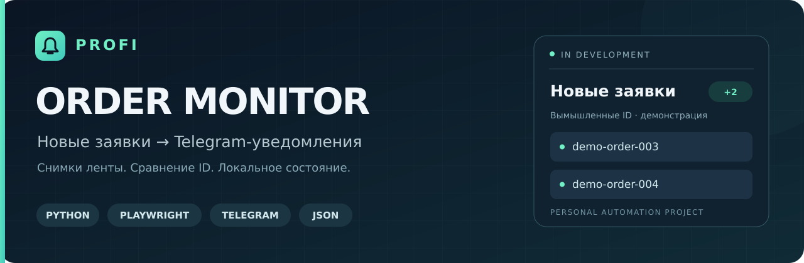
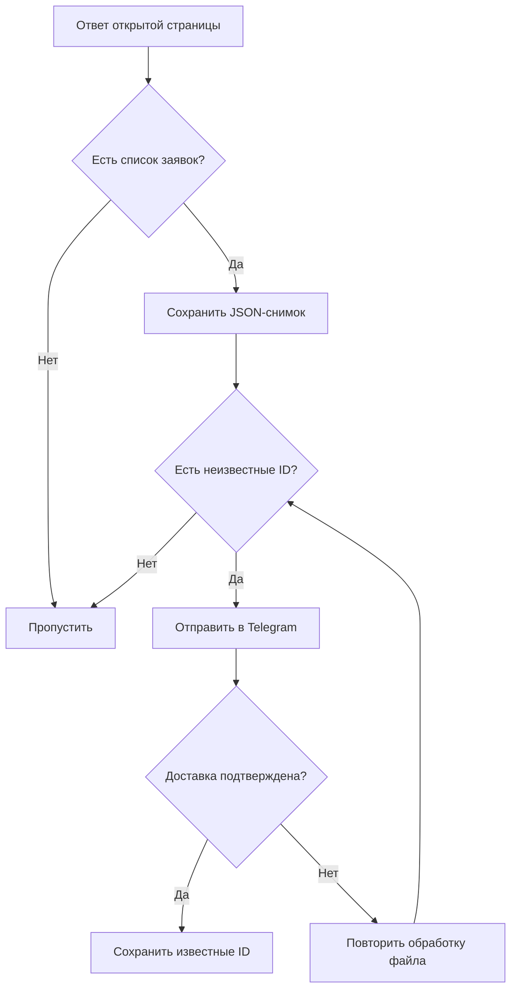

# Profi Order Monitor

**Детектор новых заявок и Telegram-уведомления.** Личный Python-проект для мониторинга ленты заказов Profi.ru: сохраняет JSON-ответы открытой страницы, находит ранее неизвестные ID и отправляет уведомление в Telegram.

`Python 3.11+` · `Playwright` · `Telegram Bot API` · `JSON` · `macOS`

**Статус: в разработке.** Это локальный прототип, а не готовый облачный сервис. Репозиторий описывает текущую реализацию; инструкция по установке будет добавлена позже.

## Зачем нужен проект

При работе с заказами важно вовремя заметить изменение ленты. Проект автоматизирует повторную проверку и переносит сигнал о новых заявках в Telegram, чтобы не сравнивать список вручную.

В основе — простая проверяемая логика: **новые ID = ID текущего снимка − уже известные ID**. Уведомление содержит идентификаторы, без анализа текста заказа и автоматического отклика клиенту.

## Что реализовано

- Сбор JSON-ответов через Playwright в видимом Chromium с локальным профилем пользователя.
- Фильтрация по маршруту `/graphql` и структуре `data.boSearchBoardItems.items`.
- Поиск ID во вложенных и пакетных ответах, исключение повторов.
- Сравнение с локальным состоянием и отправка новых ID в Telegram.
- Сохранение ID только после подтверждения доставки; повторная попытка при ошибке.
- Атомарная запись JSON-файлов и разбиение длинных уведомлений на группы.
- Отдельные процессы сбора и мониторинга, вспомогательный launcher для macOS.

## Как устроен поток данных



По умолчанию страница обновляется через случайный интервал **10–50 секунд**, каталог снимков проверяется раз в **1 секунду**, а неудачная обработка повторяется через **30 секунд**. Эти значения вынесены в настройки; они не являются гарантией скорости обнаружения.

## Пример уведомления

Ниже — демонстрация на вымышленных ID из каталога [examples](examples/README.md), не данные реального аккаунта.

```text
🔔 НОВЫЕ ЗАКАЗЫ

Найдено новых: 2

🆔 demo-order-003
🆔 demo-order-004
```

## Навигация по репозиторию

| Раздел | Назначение |
| --- | --- |
| [src/profi_order_monitor](src/profi_order_monitor) | Конфигурация, сбор ответов, разбор ID, мониторинг, Telegram и файловое состояние |
| [docs](docs/README.md) | Архитектура, текущие ограничения и план развития |
| [examples](examples/README.md) | Синтетические снимки и пример уведомления без обращения к сервисам |
| [scripts](scripts/README.md) | Вспомогательные скрипты для локального окружения и macOS |
| [tests](tests/README.md) | Автономные проверки логики и адаптеров с подменой внешних вызовов |
| [.github/workflows/checks.yml](.github/workflows/checks.yml) | Настроенный workflow: импорты, синтаксис, тесты и демонстрация |
| [pyproject.toml](pyproject.toml), [requirements.txt](requirements.txt) | Метаданные Python-пакета и зависимости |
| [.env.example](.env.example) | Образец настроек без токена и личного chat ID |

## Настройки и личные данные

Токен бота и необязательный фиксированный получатель задаются через `TELEGRAM_BOT_TOKEN` и `TELEGRAM_CHAT_ID`. Они не встроены в исходники. Если получатель не задан, прототип выбирает чат из последнего доступного входящего сообщения боту и сохраняет его в памяти процесса; для предсказуемого адресата предусмотрен явный chat ID.

Рабочие файлы по умолчанию находятся в `runtime/`: `downloads/`, `browser-profile/` и `state.json`. Эта папка, `.env`, старые каталоги `downloads/` и `browser_profile/`, а также корневой `state.json` исключены из Git. Примеры в репозитории содержат только вымышленные ID.

## Текущий этап и ограничения

- Логика разбора, состояния, уведомлений и обработки ошибок проверяется офлайн. Сквозной запуск обновлённой версии с реальной сессией Profi.ru и ботом ещё нужно проверить отдельно.
- Источник — ответы страницы в сессии пользователя, не официальная интеграция с платформой. Изменение структуры ответа или завершение сессии может прервать сбор.
- Если состояние отсутствует, все ID первого снимка считаются новыми. Существующий список известных ID не подменяется пустым при повреждённом файле.
- Работа требует запущенных процессов и бодрствующего компьютера. Автоматического удаления снимков и координации нескольких мониторов пока нет.
- Ошибки доставки не помечают ID обработанными, но абсолютная гарантия «ровно один раз» не заявляется: потеря ответа Telegram или ошибка записи состояния после отправки может привести к повторному уведомлению.

Подробнее: [архитектура](docs/architecture.md) · [план развития](docs/roadmap.md) · [правила работы с ветками](CONTRIBUTING.md).

---

Автор проекта: [ver5us1](https://github.com/ver5us1).
